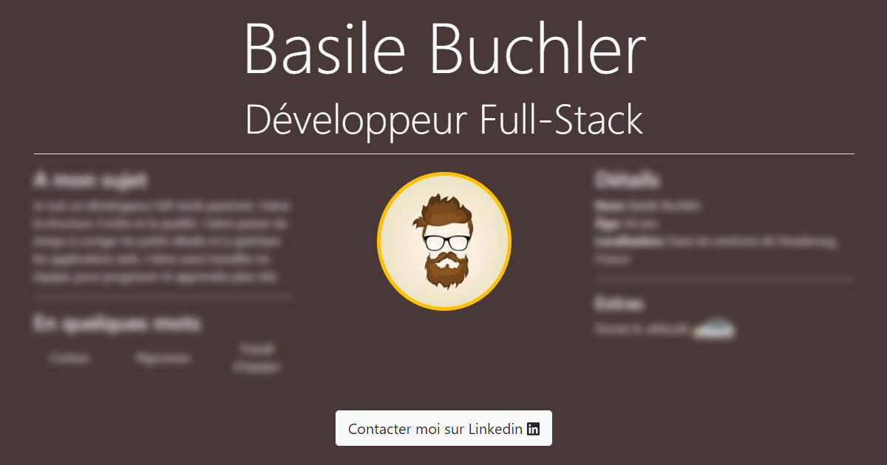

# My resume

_This project is my resume as a Single Page website._

    

        
    

## Global information

You can use a distant database to complete your resume with a [GraphQL](https://graphql.org/) query or set your resume in a [TypeScript](https://www.typescriptlang.org/) class. 
The class will be used in case of failure while reaching the database. The internalization is configured with [i18next](https://www.i18next.com/). In additional with [react-ga](https://github.com/react-ga/react-ga) you can add [Google Analytics](https://analytics.google.com/) to your website by setting your Google property in a `.env` file.

## Usage

Here are some snippets to help get started.

### Parameters

To put in a `.env` file or in your repository Secrets.

| Parameter                      | Description                                                                                      |
|--------------------------------|--------------------------------------------------------------------------------------------------|
| `REACT_APP_GRAPHQL_URL`        | GraphQL url, if not set, the Typescript class will be used                                       |
| `REACT_APP_UA_GOOGLE_PROPERTY` | Google Property to add Analytics, if not set Analytics are disabled                              |
| `SONAR_SECRET`                 | (**Only for GitHub Action**) [SonarCloud](https://sonarcloud.io/) secret to analyse your project |

### Available Scripts

This project was bootstrapped with [Create React App](https://github.com/facebook/create-react-app).
In the project directory, you can run:

- `npm start`: Runs the app in the development mode. Open http://localhost:3000 to view it in the browser.
- `npm test`: Launches the test runner in the interactive watch mode.
- `npm run build`: Builds the app for production to the `build` folder.
- `npm run eject`: See [npm run eject](https://create-react-app.dev/docs/available-scripts/#npm-run-eject)

_You can learn more in the [Create React App documentation](https://facebook.github.io/create-react-app/docs/getting-started)._
